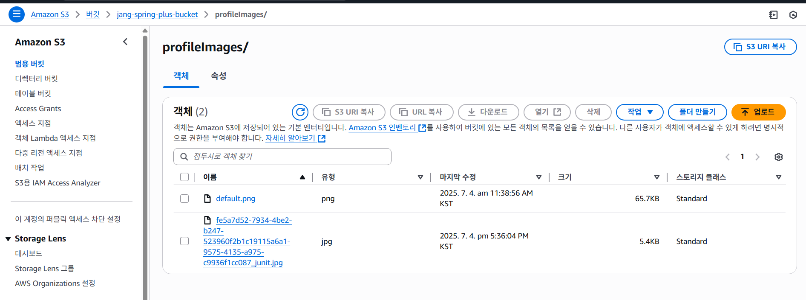

# SPRING PLUS

## EC2 설정 및 실행화면

# RDS 설정 & EC2에 연결

## S3 설정

## 프로필 이미지 업로드 API

## 프로필 이미지 삭제 API

## Health Check API

서버 상태를 확인하기 위한 API입니다.
- **URL**: `GET /health`
- **응답**:
    - 텍스트(String): `healthy`
- **인증**: 불필요
- **용도**:
    - 서버가 살아있는지 간단한 확인
    - 로드밸런서 상태 확인
